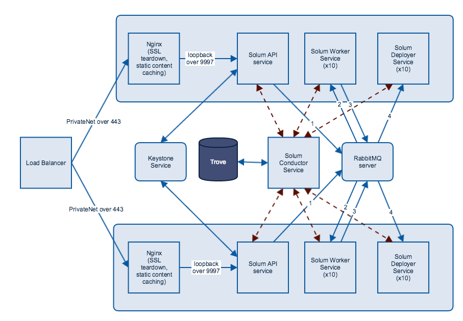

=======================
Configure and run Solum
=======================

Configuration Reference
-----------------------

To alter the default compute flavor edit /etc/solum/templates/\*.yaml
::

  flavor:
    type: string
    description: Flavor to use for servers
    default: m1.tiny

Edit the default section to the desired value.

Administrator Guide
-------------------

.. toctree::
   :maxdepth: 2

   ../man/index

High Availability Guide
-----------------------

Operations Guide
----------------

Solum has been successfully running in production environments with the following example architecture:

Solum application deployment follows this flow:

* Load Balancer listening on HTTPS port
* Traffic travels across private net to 2+ nodes to Nginx listening on port 443
* Nginx tears down SSL and redirects traffic over loopback to port 9777 to Solum API service
* Solum API Service authenticates with Keystone service (open up outbound traffic to only keystone service from Solum API)
* To retrieve Solum applications, API service would send messages to Conductor service, which communicates over service net to Trove to retrieve data
* During app deployment, Solum API service sends a queue message to Rabbit MQ service [1] (should be multi-node over private net)
* Solum Worker service picks up a queue message from Rabbit MQ [2] and pulls down a git repository, builds it, runs unit tests (if specified), builds a docker container, and uploads it to Swift
  * This is a fairly lengthy process and completely blocks this service.  You should scale out your infrastructure to easily accommodate your traffic.  A performance test based on your expected load can give you a good idea of how many nodes and how many worker services per node you need.
* Solum Worker persists application state to Trove via Conductor service
* Upon completion, worker service sends a message to Rabbit MQ [3]
* Solum Deployer service picks up the message from Rabbit MQ [4] and calls Heat to deploy a heat stack with user's information and newly created docker container
  * Deployer service also blocks on this call so your infrastructure should scale out to support your user load
* Deployer service persists application state to Trove via Conductor service

Solum deployment infrastructure is dependent on existence of the following OpenStack services:

* Nova
* Keystone
* Trove
* Swift
* Glance
* Heat

To assist with deploying a new Solum architecture, please refer to the following cookbooks to get started:

* https://github.com/rackerlabs/cookbook-openstack-paas
* https://github.com/openstack/cookbook-openstack-identity.git
* https://github.com/openstack/cookbook-openstack-common.git

Security Guide
--------------
